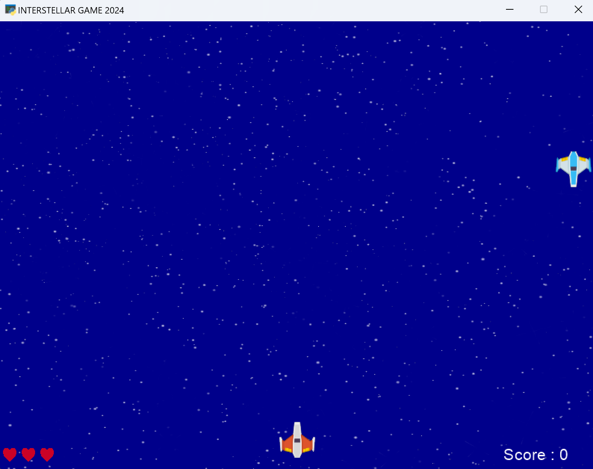
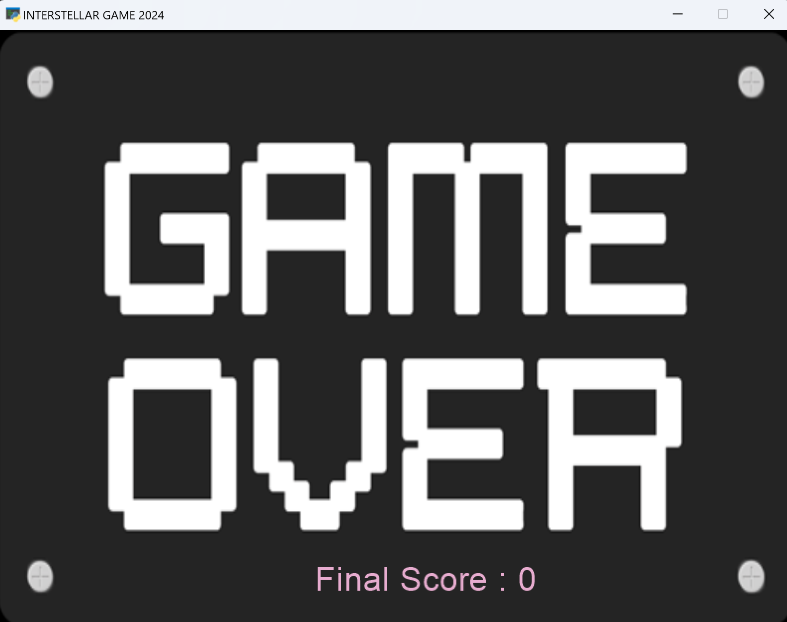

# Assigment 14

## Interrstellar Game

### How to Run
Execute this command in terminal: python file_name.py

Example: python game.py

Game that its name is interstellar. there is a spaceship at the bottom of the game window belong to you.
Another spaceships is going to come from the top of the game window. these spaceships are our enemies.

| Game instructions |                                    |
|-------------------|------------------------------------|
| move to right     | select arrow key right or select D |
| move to left      | select arrow key left or select A  |  
| fire              | select space                       |

## How to fight with enemies?

futhermore we can fire with enemies with spacekey. when you press space on keyboard, a bullet will shoot.
fortunately we have three lives in this game and we can continue playing game even we let enemies pass us and enter our planet for two times.

### Remember this point:

Anytime you collision with one of the enemies, you will lose and game over.

### Be careful:

every 20 second the speed of yur enemies would rosen and you should fight faster and faster :)

## Game over modes:
1. Run out of player hearts.
2. The player's spaceship crashes with the enemy's spaceship.

